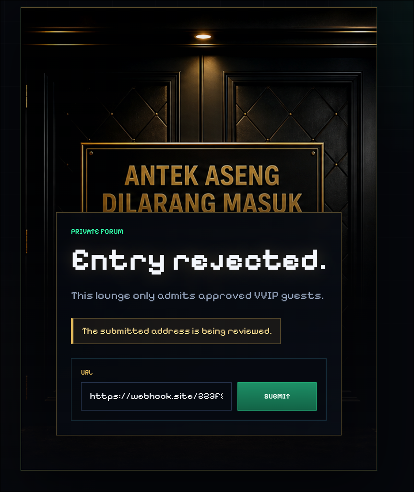
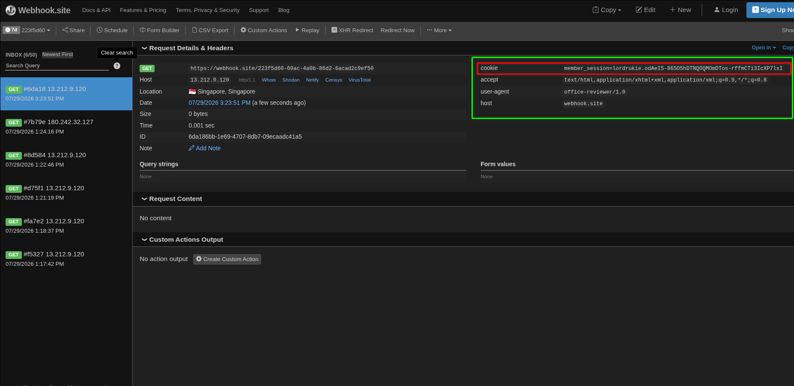
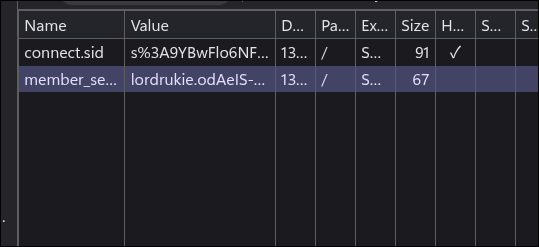
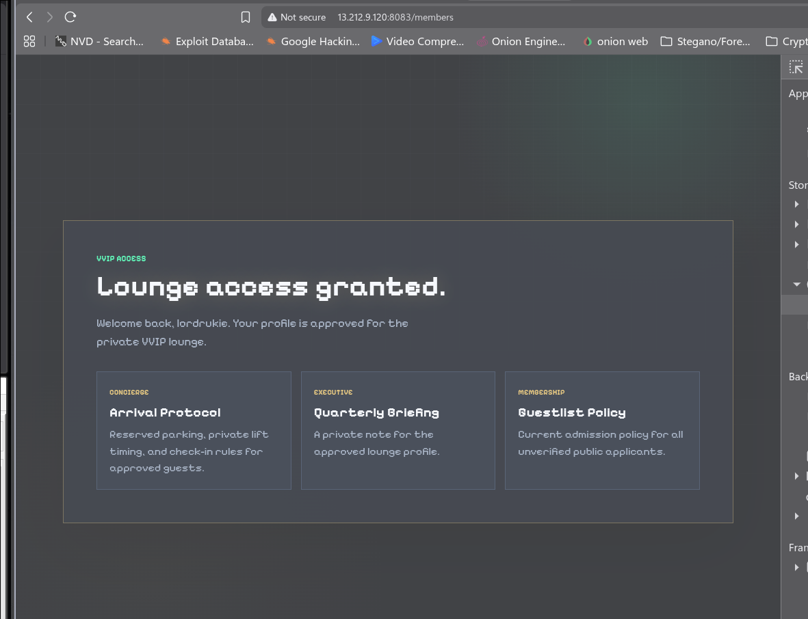
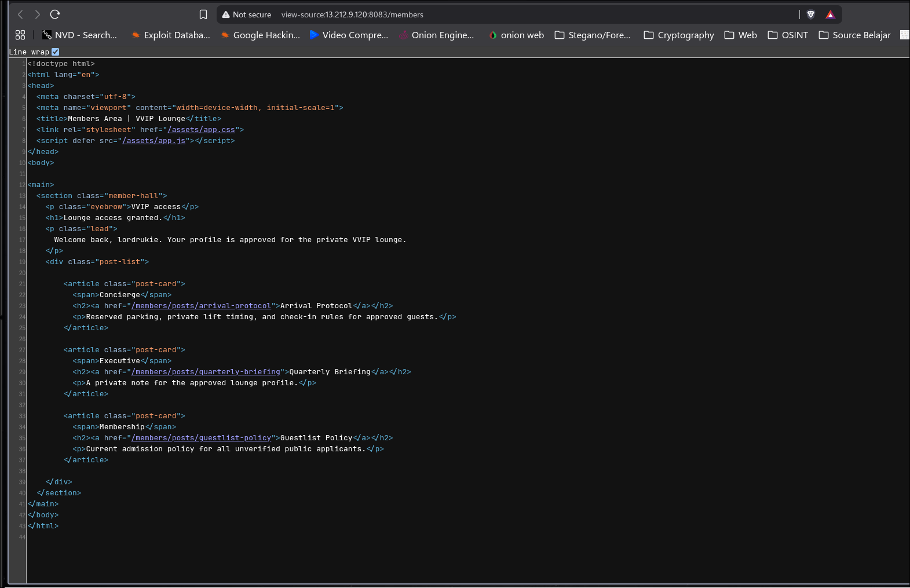
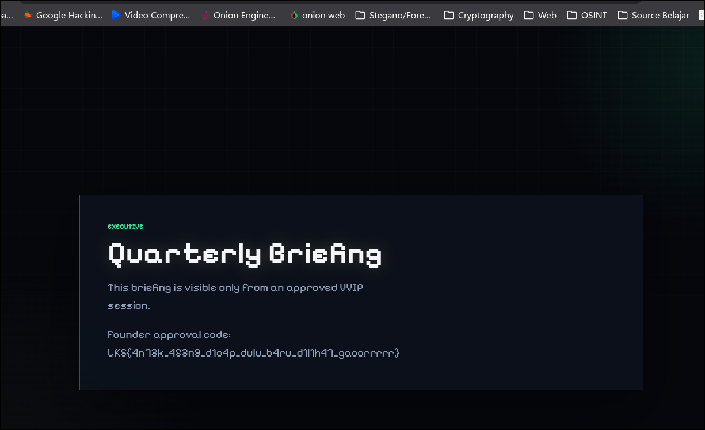

# WriteUp - antek aseng

## Overview

* **Name:** amtek aseng
* **Category:** Web Exploitation
* **Point:** 500
* **Author:** lordrukie
* **Desc:**  A closed VVIP forum keeps its private lounge posts behind a strict membership gate. Can you reach the private lounge?
* **File:** [chall.zip](./chall.zip)

## Summary

* SSRF

## Attack Idea

SSRF is an attack that forces an application server to access an external URL in order to verify access to internal services or to disclose metadata.

### How did this SSRF vulnerability first come to light in this challenge?
1. This web application is requesting a URL.
> 
>  

So, I injected the link using webhook link. <br>

At the webhook there is a cookie from the bot.

 

the code that make bot brings cookie:


[visitor,js](./bot/visitor.js)
```js
async function visitUrl(rawUrl) {
  const target = new URL(rawUrl);
  const client = target.protocol === 'https:' ? https : http;
  const port = target.port || (target.protocol === 'https:' ? 443 : 80);

  return new Promise((resolve, reject) => {
    const req = client.request({
      hostname: target.hostname,
      port,
      method: 'GET',
      path: `${target.pathname}${target.search}`,
      headers: {
        Host: target.host,
        'User-Agent': 'office-reviewer/1.0',
        Accept: 'text/html,application/xhtml+xml,application/xml;q=0.9,*/*;q=0.8',
        Cookie: `${COOKIE_NAME}=${encodeURIComponent(makeMemberCookie(REVIEWER_NAME))}` <- sending a cookie from headers
      },
      timeout: VISIT_TIMEOUT_MS
    }, (res) => {
      res.resume();
      res.on('end', () => resolve(res.statusCode));
    });

    req.on('timeout', () => req.destroy(new Error('visit timeout')));
    req.on('error', reject);
    req.end();
  });
}
```
In that section of the code block, it is also evident that this bot programme includes cookies that could be exploited by an attacker.

Cookie:
``member_session=lordrukie.odAeIS-86SO5hDTNQOQMOmDTos-rffmCTi3IcXP7lxI``

We can use the cookie by set it on **Dev Console** -> **Application** -> **Cookies**<br>
and add a new Cookies.

>
 
In **index.js** we can see there's have website routes to page

[index.js](./app/routes/index.js)
```js
const express = require('express');
const pageController = require('../controllers/pageController');

const router = express.Router();

router.get('/', pageController.getRejection);
router.get('/review', pageController.getReview);
router.post('/review', pageController.postReview);
router.get('/members', pageController.getMembers); -> we can see furthermore
router.get('/members/posts/:slug', pageController.getPost);
router.use(pageController.notFound);

module.exports = router;
```

> 

see the code using **"View Page Source"**



then we got the flag here.

> 


<b>FLAG:
----
LKS{4n73k_453n9_d1c4p_dulu_b4ru_d1l1h47_gacorrrrr}
 </b>
